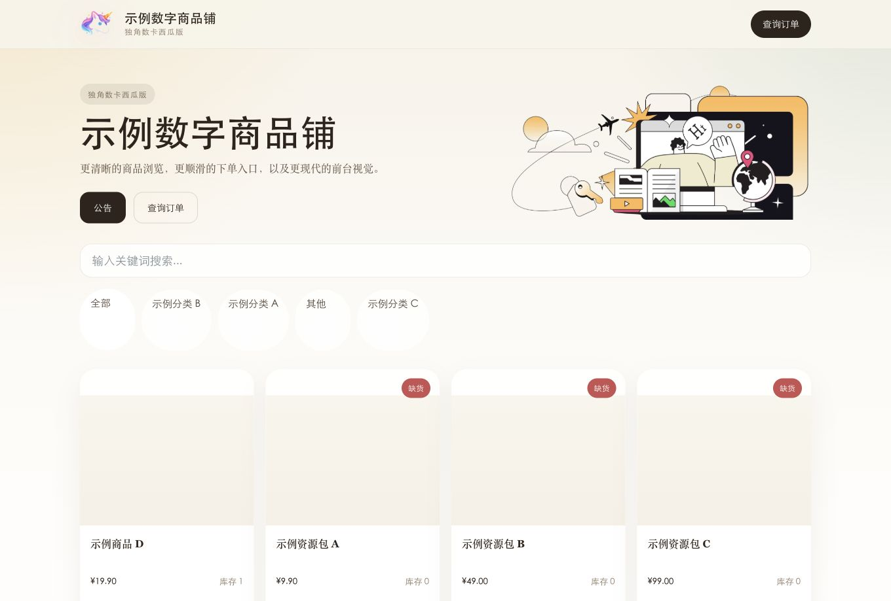
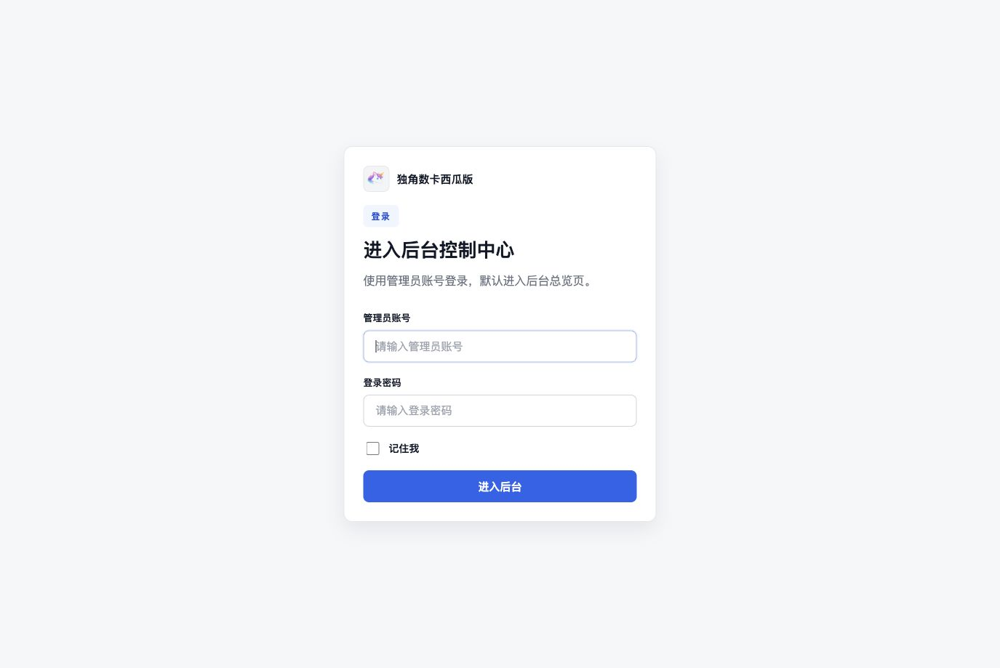
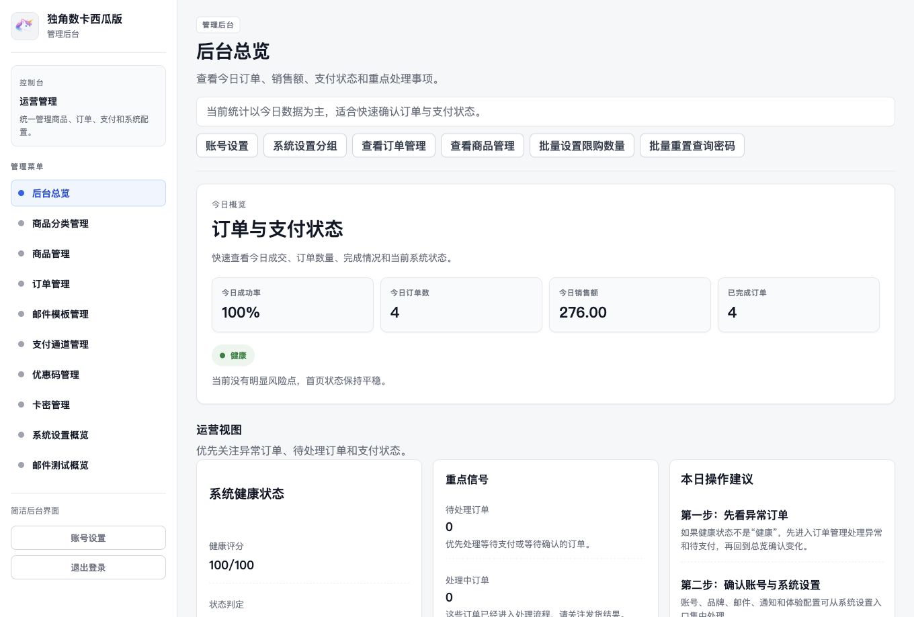
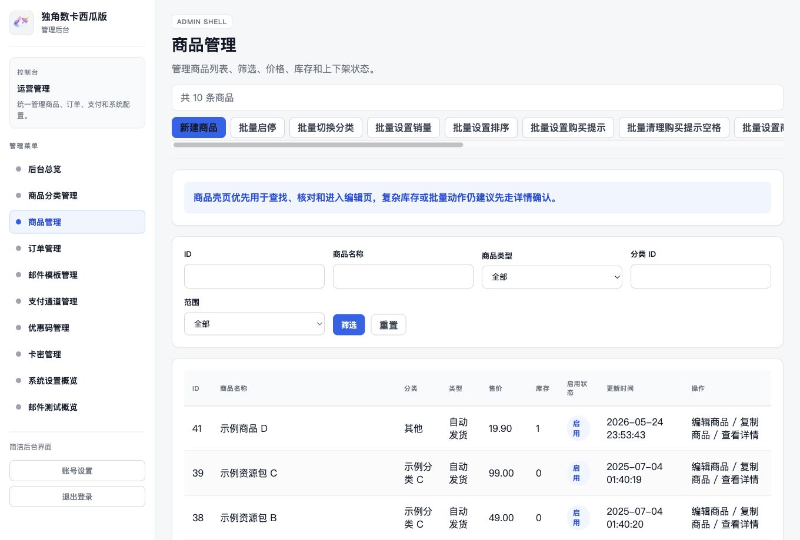

<p align="center"></p>
<p align="center">
<a href="https://opensource.org/licenses/MIT"></a>
<a href="https://github.com/Lulu-Grant/dujiaoka"></a>
<a href="https://www.php.net/releases/8.1/"></a>
<a href="https://laravel.com/docs/8.x"></a>
<a href="https://github.com/Lulu-Grant/dujiaoka/releases/tag/v3.1.1"></a>
<a href="https://www.php.net/supported-versions.php"></a>
<a href="https://github.com/Lulu-Grant/dujiaoka/actions/workflows/ci.yml"></a>
</p>

# 独角数卡西瓜版

`Lulu-Grant/dujiaoka` 是基于原始 `assimon/dujiaoka` 停更项目继续维护的分叉版本，当前品牌名为“独角数卡西瓜版”。

当前发布版本为 `v3.1.1`。这一版在 `v3.1.0` 的 PHP 8.1+ / Laravel 8.83 主线基础上，补齐前台 UI、移动端购买路径和轻量物料接入；`v3.0.0` 继续作为 Laravel 7 回滚锚点。

这个仓库现在已经不是“原样存档”，也不只是“能跑就行”的修补版，而是在保留原有业务能力前提下，持续推进现代化治理、后台替换和升级前清障的维护分支。

## 界面预览

### 前台首页



当前主目标：

- 保持 PHP 8.1 主运行时可验证
- 维持 Laravel 8.83 主线可验证
- 保持后台壳主承载，继续压缩 Dcat 到兼容层职责
- 只维护官方支付宝、官方微信、易支付、Epusdt
- 完成 `v3.1.1` 前台 UI 与移动端购买页补丁收口
- 为后续 Laravel 8、Dcat 退场、Yansongda 升级做独立实验准备

## 当前状态

- 原项目已停止维护，本仓库仍在持续推进现代化改造。
- 当前默认品牌已统一为“独角数卡西瓜版”。
- 当前 `v3.1.1` 已完成：Laravel 8.83 主线升级、PHP 8.1 PHPUnit、后台 smoke、安装流程现代化、后台壳主承载、支付通道裁剪和前台购买页移动端精修。
- 当前路线以“可验证运行 + 渐进式重构 + 后台壳主承载 + 升级实验分支”为原则推进。

如果只用一句话描述现在的位置：

- 我们已经从“停更遗留项目”推进到了“v3.1.1 前台体验补丁收口、PHP 8.1 / Laravel 8 成为主线”的阶段。

如果你想了解截至目前的改造记录，请先看：

- [重构升级日志](docs/refactor-upgrade-log.md)
- [v3.1.1 发布说明](docs/releases/v3.1.1.md)
- [v3.1.0 发布说明](docs/releases/v3.1.0.md)
- [v3.1.0-beta.1 发布说明](docs/releases/v3.1.0-beta.1.md)
- [v3.0.0 稳定版说明](docs/releases/v3.0.0-stable-readiness.md)
- [现代化路线图](docs/modernization-roadmap.md)
- [执行基线](docs/execution-baseline.md)
- [无守护进程改造清单](docs/no-daemon-migration-checklist.md)
- [安装流程现代化状态](docs/installer-modernization-status.md)
- [安全基线审计](docs/security-baseline-audit.md)

## 已完成阶段

- 恢复 PHP 7.4 遗留运行时基线，并在 v3.0.0 后切换到 PHP 8.1+ 升级主线
- 建立订单、支付、安装、后台解耦相关 PHPUnit 回归测试
- 将订单创建、支付完成、履约、通知拆成独立服务
- 清理多条现代 PHP 阻塞依赖链，并按当前维护范围退役 PayPal、Stripe、Coinbase、Mapay、TokenPay 等非核心支付通道
- 移除对常驻 `queue:work` / `supervisord` 的硬依赖
- 更新 Docker / Debian / compose 部署说明
- 将创建订单改造成明确的 DTO 输入模型
- 将安装主路径切换为 `migrate + bootstrap seed + 显式创建首个管理员`
- 将 `install.sql` 完整移出仓库主路径
- 补齐 GitHub Actions `CI` 工作流
- 补齐本地快速拉站模板与准备脚本
- 将后台高频 CRUD 页中的配置、选项源、状态映射、展示逻辑持续迁出旧 Dcat 承载层
- 将前台、后台、安装页和默认通知品牌统一为“独角数卡西瓜版”
- 将后台壳首页、商品分类、商品、订单、邮件模板、支付通道、优惠码、卡密、系统设置、邮件测试等页面逐步接入新后台壳
- 将 `app/Admin` 目录正式退场，旧后台兼容层收敛为 `config/admin.php` + `routes/admin/routes.php`
- 将 Laravel 桥接到 `8.83`，并将 Composer 运行时约束切到 PHP 8.1+

## 当前重点进度

### 后台壳

### 后台登录



### 后台总览



当前已落地后台壳资源：

- `/admin/auth/login`
- `/admin/auth/setting`
- `/admin/v2/dashboard`
- `/admin/v2/goods-group`
- `/admin/v2/goods`
- `/admin/v2/order`
- `/admin/v2/emailtpl`
- `/admin/v2/pay`
- `/admin/v2/coupon`
- `/admin/v2/carmis`
- `/admin/v2/system-setting`
- `/admin/v2/email-test`

当前后台壳已落地动作页包括：

- 商品分类 `create / edit`
- 商品 `create / edit / clone / batch-status / batch-buy-limit-num / batch-group / batch-sales-volume / batch-ord / batch-buy-prompt / batch-buy-prompt-trim / batch-description / batch-description-trim / batch-keywords / batch-keywords-suffix / batch-keywords-trim / batch-keywords-collapse-spaces / export`
- 订单 `edit / reset search password / batch-status / batch-type / batch-info / batch-title / batch-title-prefix / batch-title-suffix / batch-title-trim / batch-title-collapse-spaces / batch-reset-search-pwd / export`
- 优惠码 `create / edit / batch generate / batch-status / batch-use / batch-discount / batch-ret / batch-code / batch-code-prefix / batch-code-suffix / batch-code-replace / batch-code-trim / batch-code-collapse-spaces / export`
- 支付通道 `create / edit / copy / batch-status / batch-client / batch-method / batch-name / batch-name-prefix / batch-name-suffix / batch-name-replace / batch-name-trim / batch-name-collapse-spaces / export`
- 卡密 `create / edit / import / export / batch-loop / batch-trim / batch-collapse-spaces / batch-replace / batch-suffix`
- 邮件模板 `create / edit / preview / copy / export summary`
- 邮件测试发送
- 系统设置 `base / branding / mail / order / push / experience`

### 后台 UI



### 当前仍在推进的重点

- 保持后台壳主承载冻结，不新增高风险批量动作
- 继续压缩旧 `Dcat Admin` 到登录、认证、中间件、权限白名单和旧入口跳转职责
- 继续维护官方支付宝、官方微信、易支付和 Epusdt 的回调安全护栏
- 进入 `v3.0.0` 稳定冻结：后台壳、Dcat 兼容层、支付安全、安全治理和升级阻塞矩阵同步收敛

## 当前品牌与定位

- 品牌名：`独角数卡西瓜版`
- 仓库定位：遗留单体的持续维护分支
- 当前目标：稳定运行、逐步重构、保持 Laravel 8 / PHP 8.1 主线可验证
- 默认前台主题：`avatar`
- 当前后台状态：保留 `Dcat Admin` 最小兼容层，但后台主入口、主 dashboard 和多组高频资源已经转入后台壳
- 当前发布状态：`v3.1.1`
- 当前框架状态：Laravel `8.83.29` 已进入主线 beta，暂不直接跳 Laravel 10

## 运行与验证

当前主线推荐 PHP 8.1 Docker 验证链路：

```bash
sh scripts/php81-docker vendor/bin/phpunit --configuration phpunit.php81.xml
```

当前主线测试结果基线：

```bash
OK (417 tests, 4299 assertions)
```

PHP 8.1 Docker 验证链路：

```bash
sh scripts/composer81-docker install --no-interaction --no-progress
sh scripts/php81-docker artisan migrate:status --no-ansi
sh scripts/php81-docker vendor/bin/phpunit --configuration phpunit.php81.xml
```

当前仓库也已经补上 GitHub Actions 基线工作流：

- `CI`：在 GitHub Actions 中使用 PHP `8.1` + MariaDB 运行 PHPUnit
- 支持 `push`、`pull_request`、手动 `workflow_dispatch`
- 当前已连续通过多次主线推送验证

如果你想在本机快速把站点拉起来，可以先走这条本地开发路径：

```bash
./scripts/prepare-local-dev
sh scripts/php81-docker artisan --version
sh scripts/php81-docker artisan route:list
PHP81_DOCKER_PORT=8020 sh scripts/serve-php81-docker
ADMIN_USERNAME=admin-shell-tester ADMIN_PASSWORD=secret123 ./scripts/smoke-admin-shell
```

说明：

- 本地开发模板在 [/.env.local.example](/Users/apple/Documents/dujiaoshuka/.env.local.example)
- 准备脚本在 [/scripts/prepare-local-dev](/Users/apple/Documents/dujiaoshuka/scripts/prepare-local-dev)
- 烟雾脚本在 [/scripts/smoke-admin-shell](/Users/apple/Documents/dujiaoshuka/scripts/smoke-admin-shell)
- 默认会使用本机 `127.0.0.1:3306` 的 `dujiaoka_test` 数据库和本机 Redis
- 如果检测到 Homebrew MariaDB 的 `/private/tmp/mysql.sock`，准备脚本会自动切到 socket 模式并使用当前系统用户
- `.env` 不会进入版本控制
- 当前这条本地启动路径已经完成真实 HTTP 验证，首页可返回 `200 OK`
- 烟雾脚本会登录后台并巡检 `dashboard`、`auth/setting`、`goods/create`、`emailtpl/create`、`goods`、`order`
- 烟雾脚本必须显式传入 `ADMIN_USERNAME` / `ADMIN_PASSWORD`，且只应使用本地开发或测试专用后台账号

更多环境说明请查看：

- [遗留运行时基线说明](docs/legacy-runtime-baseline.md)
- [运行时兼容阻塞点](docs/runtime-compatibility-blockers.md)
- [本地快速拉站](docs/local-dev-quickstart.md)

## 当前审计

如果你想快速看清“已经做到哪里、还剩多少工作”，建议先看：

- [当前基线审计](docs/current-baseline-audit.md)
- [当前进度总汇](docs/current-progress-super-summary.md)
- [执行基线](docs/execution-baseline.md)
- [重构升级日志](docs/refactor-upgrade-log.md)
- [大整改执行方案](docs/rectification-execution-plan.md)

## 文档索引

- [重构升级日志](docs/refactor-upgrade-log.md)
- [现代化路线图](docs/modernization-roadmap.md)
- [无守护进程改造清单](docs/no-daemon-migration-checklist.md)
- [遗留运行时基线说明](docs/legacy-runtime-baseline.md)
- [运行时兼容阻塞点](docs/runtime-compatibility-blockers.md)
- [安装流程现代化状态](docs/installer-modernization-status.md)
- [安全基线审计](docs/security-baseline-audit.md)
- [数据库现代化拆解计划](docs/database-modernization-plan.md)
- [后台替换评估](docs/admin-replacement-assessment.md)
- [执行基线](docs/execution-baseline.md)
- [升级前清障清单](docs/upgrade-readiness-checklist.md)
- [支付通道退场记录](docs/paypal-stripe-transition-plan.md)
- [本地快速拉站](docs/local-dev-quickstart.md)
- [当前基线审计](docs/current-baseline-audit.md)
- [当前进度总汇](docs/current-progress-super-summary.md)
- [后台壳动作边界矩阵](docs/admin-shell-action-boundary-matrix.md)
- [v3.1.1 发布说明](docs/releases/v3.1.1.md)
- [v3.1.0 发布说明](docs/releases/v3.1.0.md)
- [v3.1.0-beta.1 发布说明](docs/releases/v3.1.0-beta.1.md)
- [v3.0.0 稳定版说明](docs/releases/v3.0.0-stable-readiness.md)
- [发布稳定路线图](docs/release-stabilization-roadmap.md)

## 说明

- 当前仓库仍是遗留系统的渐进式改造阶段，不是最终现代化完成态。
- 当前 `v3.1.1` 已具备：Laravel 8.83、PHP 8.1 运行时验证、本地快速拉站、GitHub Actions 自动回归、安装现代化主路径、后台壳主承载基础和前台购买页移动端精修。
- 当前 `/admin` 默认已经落到新的后台壳首页。
- 当前后台登录、退出和账号设置也已经切到后台壳入口。
- 后续每一个重要节点都会持续记录到 [重构升级日志](docs/refactor-upgrade-log.md)。
